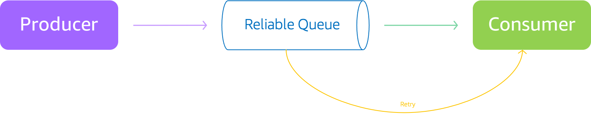
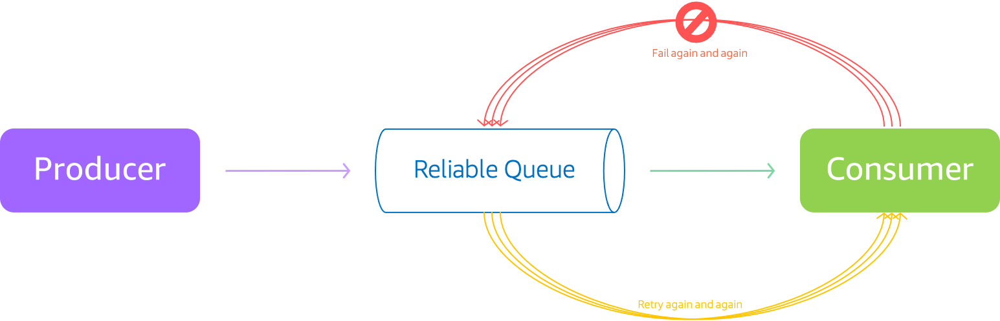
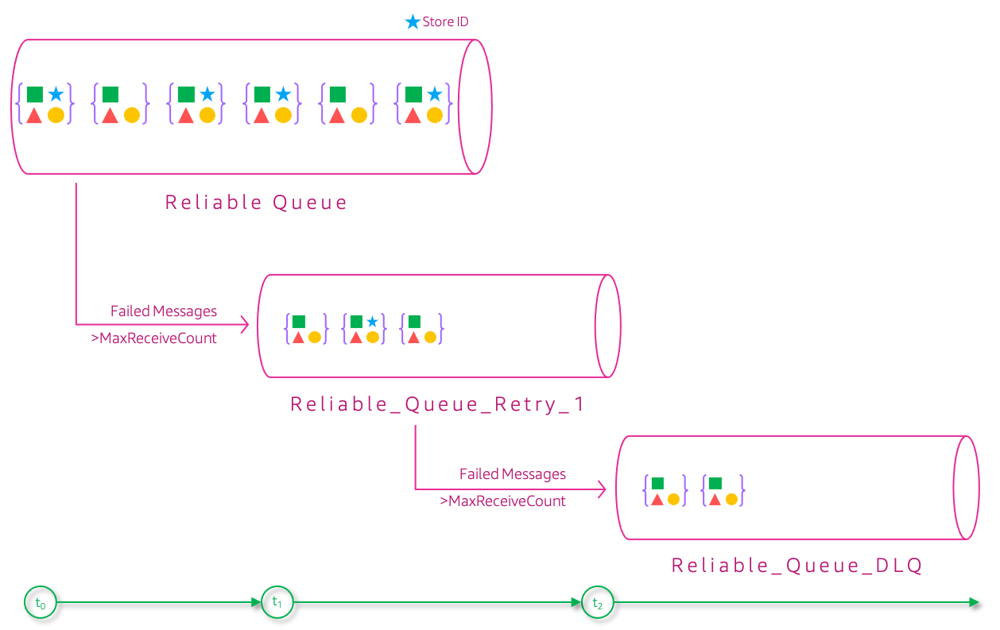
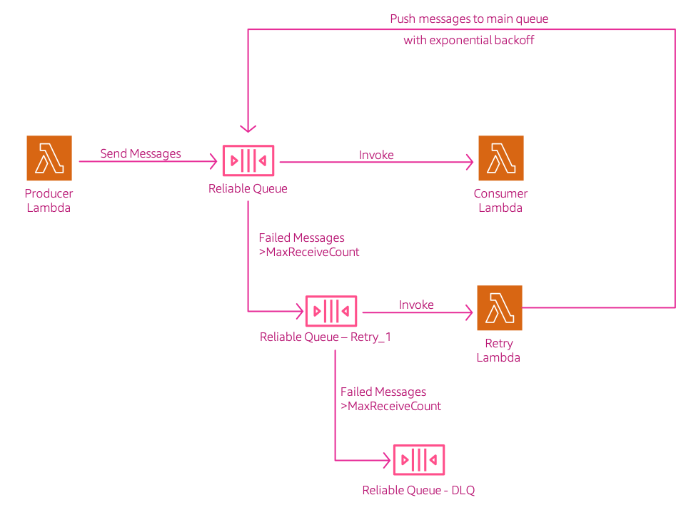
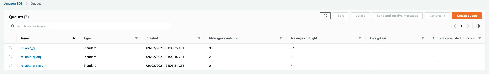
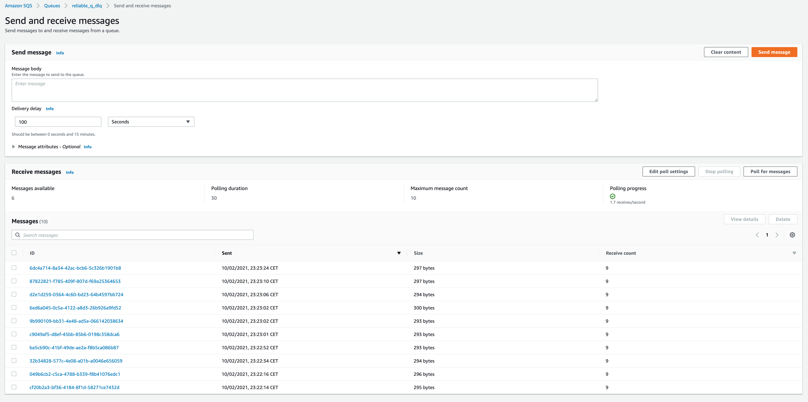
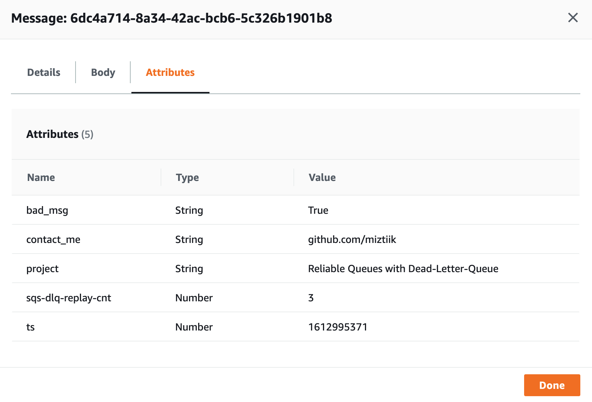

# Reliable Message Processing with Dead-Letter-Queues Replay

Mystique Unicorn App uses message queues to orchestrate their workflows. The messages that are ingested in the queues are produced by stores in multiple geographical locations. At times some messages fail to get processed and gets moved to their _Dead Letter Queue(DLQ)_. When the team implemented a retry mechanism for the DLQ, some of the messages gets processed successfully, while others did not, making the retry mechanism get stuck on _bad messages_. Can you help them with a solution that will process these messages reliably.


## 🎯 Solutions

Occasionally the backend consumers will not be able to process the incoming message._For example_, if a user places an order within a certain number of minutes of creating an account, the _producer_ might pass the message with an empty string instead of a `customer identifier`. There are times even valid messages end up in DLQ. Lets take a look at some of them, 

- **Misconfigured Visibility Timeouts** - The SQS visibility timeout should always be greater than the Lambda function’s timeout. If the _lambda consumer function_ has a higher timeout value then in-flight messages can be available again and processed more than once. Functions receive messages in batches, and the messages are deleted from the queue only after the function completes successfully. It means that even if _only one message_ was slow to process, the entire batch can elapse their visibility timeout and become available again in the queue.
- **Lambda Concurrency** - If you are seeing a burst of messages and lambda is your consumer with not enough concurrency, then your lambda will be throttled leaving your messages unprocessed by increment your message receive count.
- **SQS/Lambda Batch Size** - If your lambda receives more messages than it can process within itself time limit, messages will end up in DLQ

For these reasons messages that can not be processed in a timely manner must be retried reliably and delivered to a dead-letter message queue. 




A simple retry mechanism of repeatedly processing failed messages can clog batch processing. The worst offenders consistently exceed the retry limit, which also means that they take the longest and use the most resources. To address the problem of blocked batches, we set up a distinct `retry queue`. Messages from the `source queue` is moved to the `retry queue` after `x` number of attempts. In AWS SQS, we can define this using `maxReceiveCount`.  If the consumer of the `retry queue` still does not return success, then that message is moved to the dead letter queue.



It is important not to simply re-attempt failed requests immediately one after the other; doing so will amplify the number of calls, essentially spamming bad requests. Rather, each subsequent level of retry enforce a processing delay, in other words, a timer that increases as a `maxReceiveCount` of a message increases. We can achieve this by using AWS SQS message timers `DelaySeconds`. We will use exponential back-off with jitter to introduce the delay.



In this demo, We will build an source queue `reliable_q`, a retry queue `reliable_q_retry_1` and also DLQ that will be `dlq_for_reliable_q`. We will have lambda functions to produce some messages(to act as stores/producers) and ingest them into our `reliable_q`. Another lambda to act as a consumer to process these messages. When our consumer lambda encounters any message without `store_id` attribute, the lambda will throw an exception. The primary queue is configured to process the failed message for `5` times(`maxReceiveCount`). If it still fails, then the messages are _automatically_ moved to retry queue, where we will attempt to process the message with backoff and jitter for another `3` time. If the messages fail to process after `8` attempts they will be moved to the `dlq_for_reliable_q`

As we are generating the incoming messages, we need a way to introduce some errors that we cause some failures at the consumer end. To achieve this, I have instrumented the produce to not include `store_id` message attribute on some messages and add a `bad_msg` message attribute instead. Our consumers will look for this attribute and throw an exception, when this message attribute is unavailable. As we process messages in batches of `5`, even if one of the messages miss the attribute, the entire batch will be marked as failed to process by SQS. This will allows to check later in the DLQ, if our single retry queue with backoff and jitter was able to successfully processes all good messages and moves the bad messages to DLQ _or_ find out if our _batch size_ is too big that allows some good messages also to fail?

The final AWS architecture looks something like,



In this article, we will build an architecture, similar to the one shown above. We will start backwards so that all the dependencies are satisfied.

1.  ## 🧰 Prerequisites

    This demo, instructions, scripts and cloudformation template is designed to be run in `us-east-1`. With few modifications you can try it out in other regions as well(_Not covered here_).

    - 🛠 AWS CLI Installed & Configured - [Get help here](https://youtu.be/TPyyfmQte0U)
    - 🛠 AWS CDK Installed & Configured - [Get help here](https://www.youtube.com/watch?v=MKwxpszw0Rc)
    - 🛠 Python Packages, _Change the below commands to suit your OS, the following is written for amzn linux 2_
      - Python3 - `yum install -y python3`
      - Python Pip - `yum install -y python-pip`
      - Virtualenv - `pip3 install virtualenv`

1.  ## ⚙️ Setting up the environment

    - Get the application code

      ```bash
      git clone https://github.com/miztiik/reliable-sqs-with-dlq
      cd reliable-sqs-with-dlq
      ```

1.  ## 🚀 Prepare the dev environment to run AWS CDK

    We will use `cdk` to make our deployments easier. Lets go ahead and install the necessary components.

    ```bash
    # You should have npm pre-installed
    # If you DO NOT have cdk installed
    npm install -g aws-cdk

    # Make sure you in root directory
    python3 -m venv .venv
    source .venv/bin/activate
    pip3 install -r requirements.txt
    ```

    The very first time you deploy an AWS CDK app into an environment _(account/region)_, you’ll need to install a `bootstrap stack`, Otherwise just go ahead and deploy using `cdk deploy`.

    ```bash
    cdk bootstrap
    cdk ls
    # Follow on screen prompts
    ```

    You should see an output of the available stacks,

    ```bash
    reliable-queues-with-retry-dlq-producer-stack
    reliable-queues-with-retry-dlq-consumer-stack
    reliable-queues-with-retry-dlq-stack
    ```

1.  ## 🚀 Deploying the application

    Let us walk through each of the stacks,

    - **Stack: reliable-queues-with-retry-dlq-producer-stack**

      This stack will create all sqs queue that we need for this solution
      - Source Queue: `reliable_q` - Producers will send their messages to this queue. 
        - Any new message will be hidden(`DelaySeconds`) for `2` seconds
        - SQS Long Polling<sup>[1]</sup> will be set. The queue will also wait for `10` seconds before sending out a batch to consumers.
        - To ensure messages are given enough time to be processed by the consumer, the visibility timeout is set to `10` seconds. Note that the lambda consumer timeout should be lesser than the visibility timeouts.
        - Any messages not processed after(`MaxReceiveCount`) `3` tries are pushed to the retry queue.
      - Retry Queue: `reliable_q_retry_1` - The retry queue for the source queue. _Notice the one at the end, You can extend this logic to have cascading retry queues with different consumer processing logic at each level_
        - New message will be hidden<sup>[2]</sup>(`DelaySeconds`) for `10` seconds
        - Any messages not processed after(`MaxReceiveCount`) `5` tries are pushed to the retry queue.
      - Dead Letter Queue: `dlq_for_reliable_q`- This is where the messages are left, when they remain unsuccessfully processed by the `reliable_q` and subsequently by `reliable_q_retry_1`.

      If you want to know more about the queue parameters, check these pages [3] & [4].


      Initiate the deployment with the following command,

      ```bash
      cdk deploy reliable-queues-with-retry-dlq-producer-stack
      ```

      After successfully deploying the stack, Check the `Outputs` section of the stack. You will find the `ReliableMessageQueue` and the producer lambda function `SqsDataProducer`. We will invoke this function later during our testing phase.

    - **Stack: reliable-queues-with-retry-dlq-consumer-stack**

      This stack will create the lambda function that will have our `reliable_q` as our event source. When ever there is a message in our reliable queue, this function will be invoked. Lambda will receive a batch of `5` messages from SQS.

      Initiate the deployment with the following command,

      ```bash
      cdk deploy reliable-queues-with-retry-dlq-consumer-stack
      ```

      After successfully deploying the stack, Check the `Outputs` section of the stack. You will find the `msgConsumer` lambda function.


1.  ## 🔬 Testing the solution

    1. **Invoke Producer Lambda**:
      Let us start by invoking the lambda from the producer stack `reliable-sqs-with-dlq-producer-stack` using the AWS Console. If you want to ingest more events, use another browser window and invoke the lambda again.
          ```json
          {
            "statusCode": 200,
            "body": "{\"message\": {\"status\": true, \"tot_msgs\": 89, \"bad_msgs\": 4}}"
          }
          ```
        Here in this invocation, We have ingested about `89` messages. Within those message, we have `4` messages does not have `store_id` identified as `bad_msgs`.

    1. **Check Consumer Cloudwatch Logs**:

       After a couple of minutes, check the consumer cloudwatch logs. Usually the log name should be something like this, `/aws/lambda/queue_consumer_fn_reliable-queues-with-retry-dlq-consumer-stack`. Navigate to the log stream

       You should be finding some sucessfully processed messages like this,
       ```json
        {
          "resp": {
                "status": true,
                "tot_msgs": 5,
                "s_msgs": 5
            }
        }
       ```
       
       and some  `ERROR` messages like this. 
       ```py
        [ERROR] Exception: {"missing_store_id":True}
        Traceback (most recent call last):
          File "/var/task/index.py", line 113, in lambda_handler
            m_process_stat = process_msgs(event["Records"])
          File "/var/task/index.py", line 97, in process_msgs
            raise e
          File "/var/task/index.py", line 86, in process_msgs
            raise Exception(err)
       ```

       If you look in the log group for the retry function logs `/aws/lambda/sqs_retry_fn_reliable-queues-with-retry-dlq-stack`, you will find that the retry mechanism is working and pushing messages back to the main queue, 
       ```json
        {
            "resp": {
                "status": false,
                "tot_msgs": 1,
                "replay_cnt": 2,
                "max_attempts": 3,
                "replayed_to_main_q": true,
                "delay_sec": 3.9890051390149157
            }
        }
       ```
       In case of the above message, It has been attempted to process `2` so far and one less than the max attempts `3`, hence it has been pushed the main queue with a delay of `>3` seconds.

       There will also be some messages that had reached the max attempts, those will result in an error like this,

       ```py
        [ERROR] MaxAttemptsError: Number of retries(4) > max attempts(3)
        Traceback (most recent call last):
          File "/var/task/index.py", line 61, in lambda_handler
            replay=replay_cnt, max=GlobalArgs.MAX_ATTEMPTS)
       ```

       Once you have confirmed this, check out the SQS Console. You will find the failed messages moved to the DLQ `dlq_for_reliable_q`.

       
       If you go ahead and poll the queue for messages, you will find the receive count is `>3`. You can also open one of the messages and look into the _attributes_
       
       


1.  ## 📒 Conclusion

    Here we have demonstrated how to use exponential backoff and retry mechanism for SQS queues and make sure your messages are processed reliably and move failed messages to a different queue for additional processing. You can extend this by adding a another retry queue or another lambda to process the message from DLQ with more scrutiny.

1.  ## 🧹 CleanUp

    If you want to destroy all the resources created by the stack, Execute the below command to delete the stack, or _you can delete the stack from console as well_

    - Resources created during [Deploying The Application](#-deploying-the-application)
    - Delete CloudWatch Lambda LogGroups
    - _Any other custom resources, you have created for this demo_

    ```bash
    # Delete from cdk
    cdk destroy

    # Follow any on-screen prompts

    # Delete the CF Stack, If you used cloudformation to deploy the stack.
    aws cloudformation delete-stack \
      --stack-name "MiztiikAutomationStack" \
      --region "${AWS_REGION}"
    ```

    This is not an exhaustive list, please carry out other necessary steps as maybe applicable to your needs.

## 📌 Who is using this

This repository aims to show how to use a exponential backoff and retry mechanism for messages to new developers, Solution Architects & Ops Engineers in AWS. Based on that knowledge these Udemy [course #1][103], [course #2][102] helps you build complete architecture in AWS.

### 💡 Help/Suggestions or 🐛 Bugs

Thank you for your interest in contributing to our project. Whether it is a bug report, new feature, correction, or additional documentation or solutions, we greatly value feedback and contributions from our community. [Start here](/issues)

### 👋 Buy me a coffee

[](https://ko-fi.com/Q5Q41QDGK) Buy me a [coffee ☕][900].

### 📚 References

1. [Docs: Amazon SQS Long Polling][1]
1. [Docs: Amazon SQS Message Timers][2]
1. [Docs: Amazon SQS Queue Parameters][3]
1. [Docs: Amazon SQS Queue Cloudformation Properties][4]


### 🏷️ Metadata


**Level**: 200

[1]: https://docs.aws.amazon.com/AWSSimpleQueueService/latest/SQSDeveloperGuide/sqs-short-and-long-polling.html#sqs-long-polling
[2]: https://docs.aws.amazon.com/AWSSimpleQueueService/latest/SQSDeveloperGuide/sqs-message-timers.html
[3]: https://docs.aws.amazon.com/AWSSimpleQueueService/latest/SQSDeveloperGuide/sqs-configure-queue-parameters.html
[4]: https://docs.aws.amazon.com/AWSCloudFormation/latest/UserGuide/aws-properties-sqs-queues.html

[100]: https://www.udemy.com/course/aws-cloud-security/?referralCode=B7F1B6C78B45ADAF77A9
[101]: https://www.udemy.com/course/aws-cloud-security-proactive-way/?referralCode=71DC542AD4481309A441
[102]: https://www.udemy.com/course/aws-cloud-development-kit-from-beginner-to-professional/?referralCode=E15D7FB64E417C547579
[103]: https://www.udemy.com/course/aws-cloudformation-basics?referralCode=93AD3B1530BC871093D6
[899]: https://www.udemy.com/user/n-kumar/
[900]: https://ko-fi.com/miztiik
[901]: https://ko-fi.com/Q5Q41QDGK
